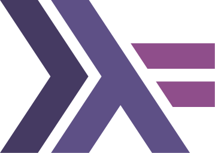
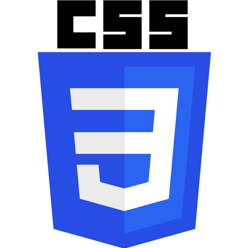

### Hi there, I'm [Blake Rain][website] 👋

### Social Media

[][website]
[][twitter]
[][linkedin]

 

### Languages and Tools

[][lang-cpp]
[][lang-hs]
[][lang-py]
[][lang-js]
[][lang-html]
[][lang-css]
[][lib-react]
[][lib-nodejs]
[][tool-git]
[][tool-github]
[][tool-vscode]

 
 

[website]: https://blakerain.com/
[twitter]: https://twitter.com/HalfWayMan
[linkedin]:
  https://www.linkedin.com/in/blake-rain-40580b20?lipi=urn%3Ali%3Apage%3Ad_flagship3_profile_view_base_contact_details%3BQGKukDZDTVCtvramYiEA0Q%3D%3D
[lang-cpp]: https://en.wikipedia.org/wiki/C%2B%2B
[lang-hs]: https://www.haskell.org
[lang-py]: https://www.python.org
[lang-js]: https://en.wikipedia.org/wiki/JavaScript
[lang-html]: https://en.wikipedia.org/wiki/HTML
[lang-css]: https://en.wikipedia.org/wiki/CSS
[lib-react]: https://reactjs.org
[lib-nodejs]: https://nodejs.org/
[tool-git]: https://git-scm.com
[tool-github]: https://github.com/
[tool-vscode]: https://code.visualstudio.com
